# EventPass 🎫

Plateforme web de gestion d'événements développée dans le cadre d'un projet académique.

---

## Aperçu de l'Application

### Connexion
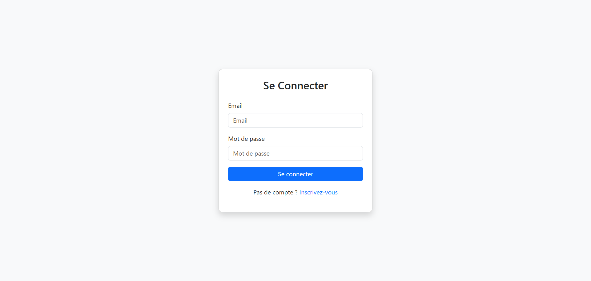

### Inscription
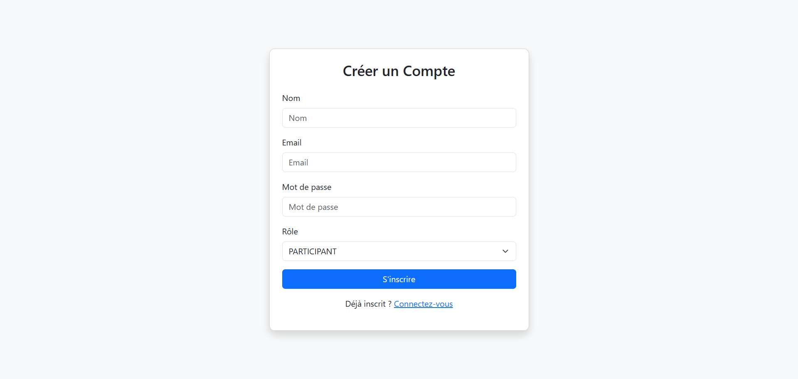

### Pour Organisateurs
### Dashboard Administrateur
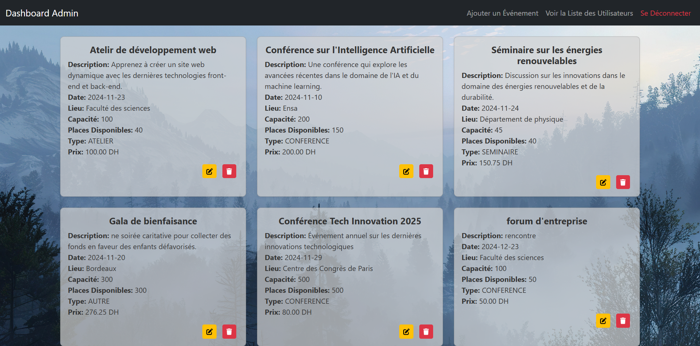

### Ajout d'un Événement
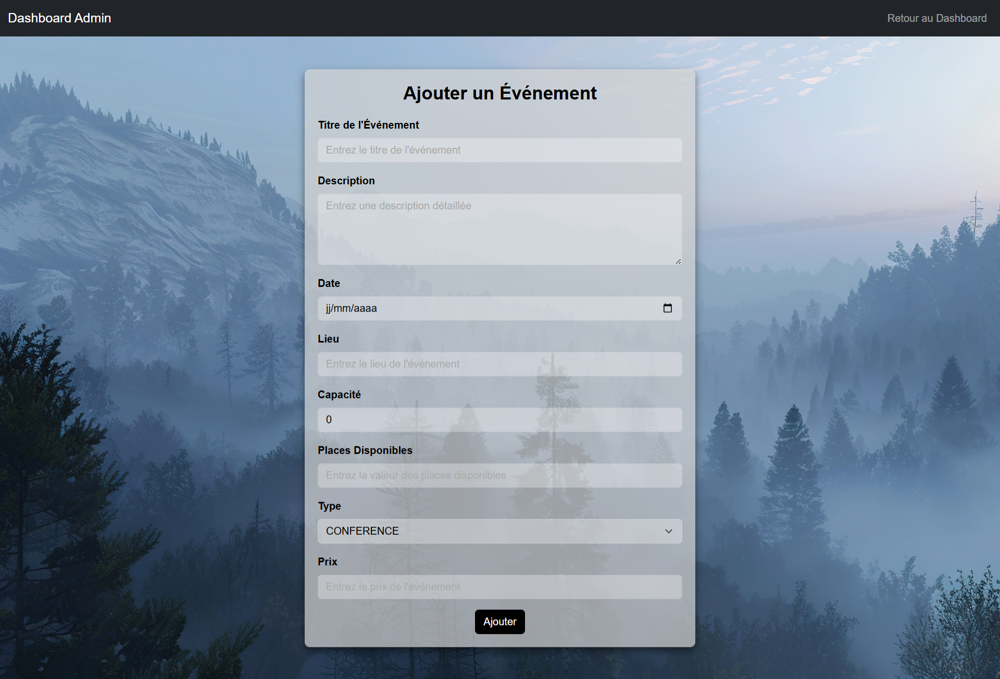

### Modification d'un Événement
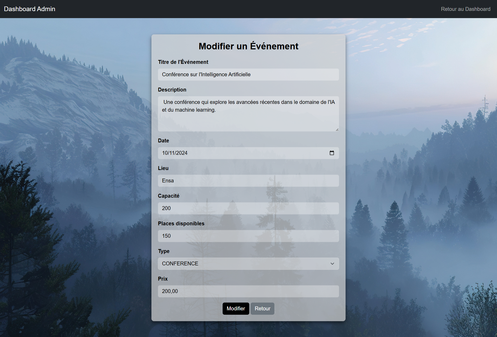

### Liste des Utilisateurs
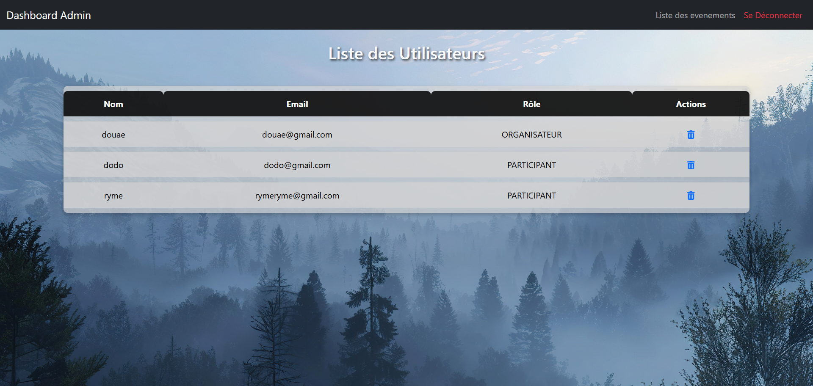

### Pour Utilisateurs
### Page d'accueil
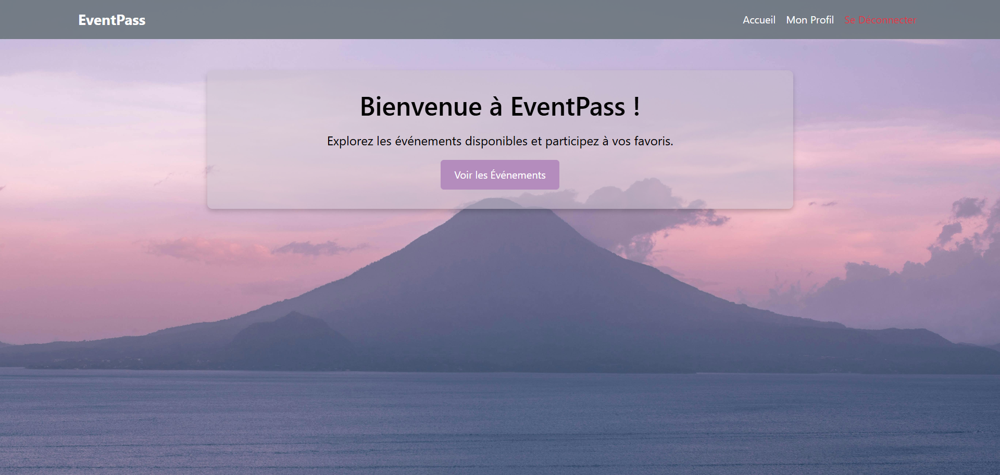

### Liste des Événements
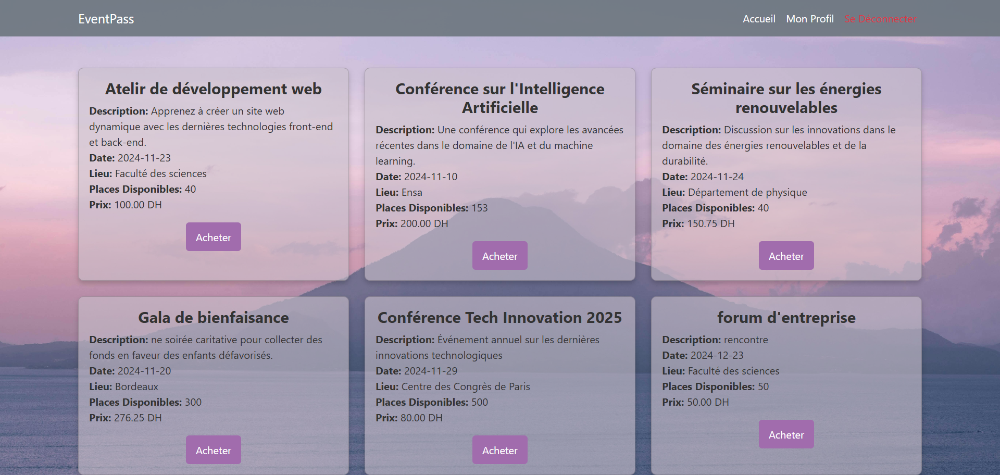

### Formulaire d'Achat
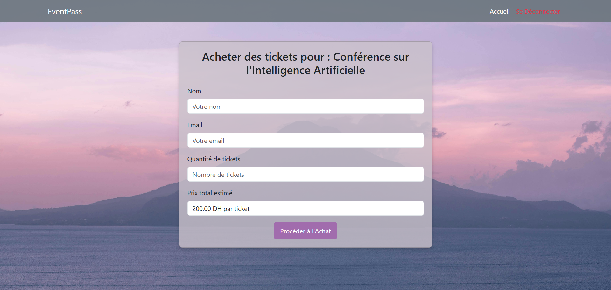

### Formulaire de Paiement


### Achat Réussi
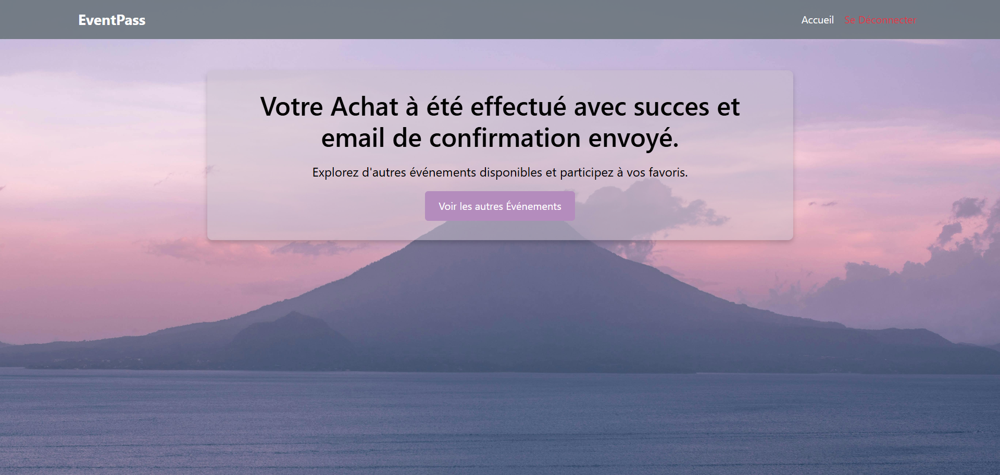

### Page Profil
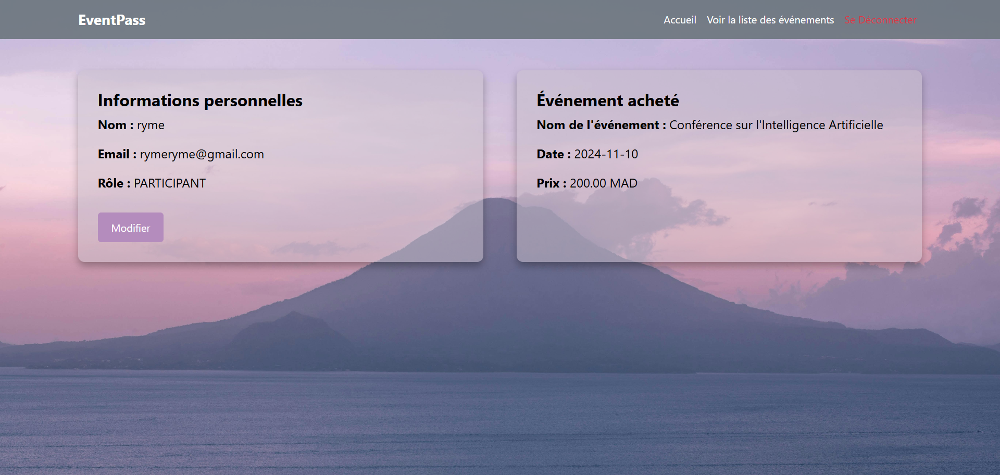

---

## Stack Technique

| Côté | Technologies |
|------|-------------|
| Backend | Java 21, Spring Boot 3.4.0 |
| Sécurité | Spring Security 6, BCrypt |
| Persistance | Spring Data JPA, Hibernate |
| Base de données | MySQL 8 |
| Frontend | Thymeleaf, Bootstrap, HTML/CSS |
| Email | Spring Boot Mail (SMTP) |
| Build | Maven |
| IDE | IntelliJ IDEA |

---

## Fonctionnalités

### Espace Organisateur
- Authentification sécurisée avec gestion des rôles
- Création, modification et suppression d'événements
- Tableau de bord administrateur
- Gestion et suppression des utilisateurs

### Espace Participant
- Inscription et connexion
- Consultation de la liste des événements disponibles
- Achat de tickets avec calcul du prix total
- Notifications par email après inscription/achat
- Page profil

---

## Prérequis

- Java 21+
- Maven 3.8+
- MySQL 8+

---

## Installation

### 1. Cloner le projet

```bash
git clone https://github.com/DouaeZN/Event_Pass.git
cd Event_Pass
```

### 2. Configurer la base de données

Créer une base de données MySQL :

```sql
CREATE DATABASE gestion_evenement;
```

### 3. Configurer l'application

Créer le fichier `src/main/resources/application.properties`:

```bash
cp src/main/resources/application.properties.example src/main/resources/application.properties
```

Puis modifier avec vos valeurs :

```properties
spring.datasource.url=jdbc:mysql://localhost:3306/gestion_evenement
spring.datasource.username=YOUR_DB_USERNAME
spring.datasource.password=YOUR_DB_PASSWORD

spring.jpa.hibernate.ddl-auto=update
spring.jpa.show-sql=true

spring.mail.host=smtp.gmail.com
spring.mail.port=587
spring.mail.username=YOUR_EMAIL
spring.mail.password=YOUR_APP_PASSWORD
spring.mail.properties.mail.smtp.auth=true
spring.mail.properties.mail.smtp.starttls.enable=true
```

### 4. Lancer l'application

```bash
mvn spring-boot:run
```

L'application sera accessible sur : **http://localhost:8080**

---

## Structure du Projet

```
Event_Pass/
├── src/
│   ├── main/
│   │   ├── java/com/example/gestion_evenement/
│   │   │   ├── Config/           # Configuration Spring Security
│   │   │   ├── Controller/       # Contrôleurs MVC
│   │   │   │   ├── AchatController
│   │   │   │   ├── AdminController
│   │   │   │   ├── EvenementController
│   │   │   │   └── UtilisateurController
│   │   │   ├── Models/           # Entités JPA
│   │   │   ├── Repositories/     # Interfaces Spring Data JPA
│   │   │   │   ├── AchatRepository
│   │   │   │   ├── EvenementRepository
│   │   │   │   └── UtilisateurRepository
│   │   │   ├── Security/         # Gestion de l'authentification
│   │   │   └── Services/         # Logique métier
│   │   │       ├── AchatService
│   │   │       ├── EmailService
│   │   │       ├── EvenementService
│   │   │       └── UtilisateurService
│   │   └── resources/
│   │       ├── templates/        # Vues Thymeleaf
│   │       └── application.properties.example
│   └── test/
├── docs/
│   └── screenshots/
├── .gitignore
├── .gitattributes
├── pom.xml
└── README.md
```

---

## Rôles Utilisateurs

| Rôle | Accès |
|------|-------|
| `ORGANISATEUR` | Dashboard admin, CRUD événements, gestion utilisateurs |
| `PARTICIPANT` | Page d'accueil, liste événements, achat de tickets |

---

## Développé par

**Zayani Douae**  

